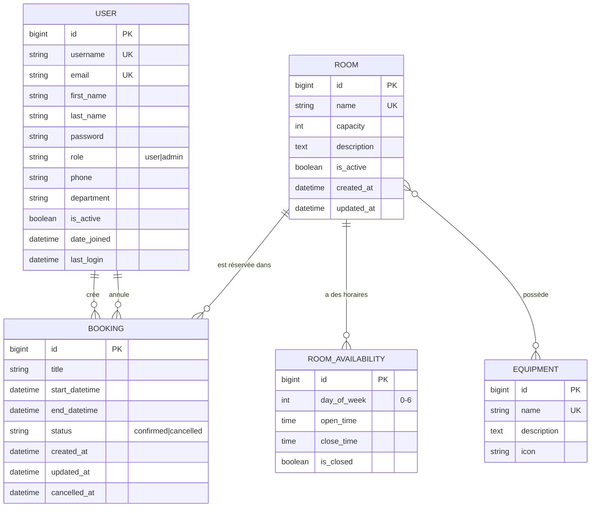
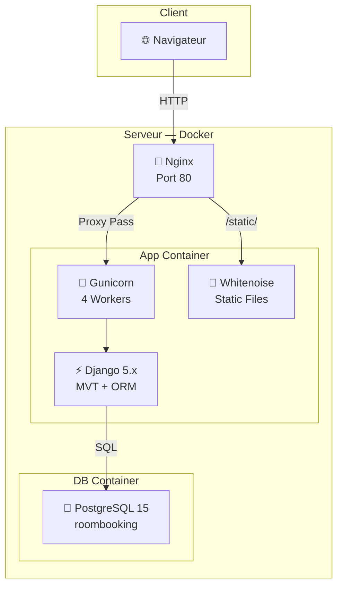
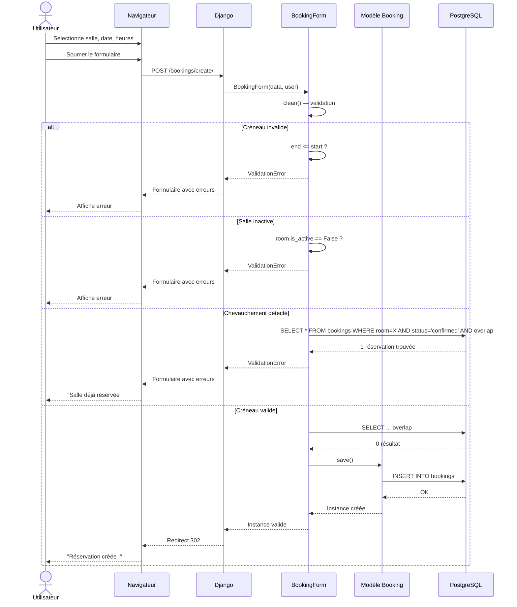
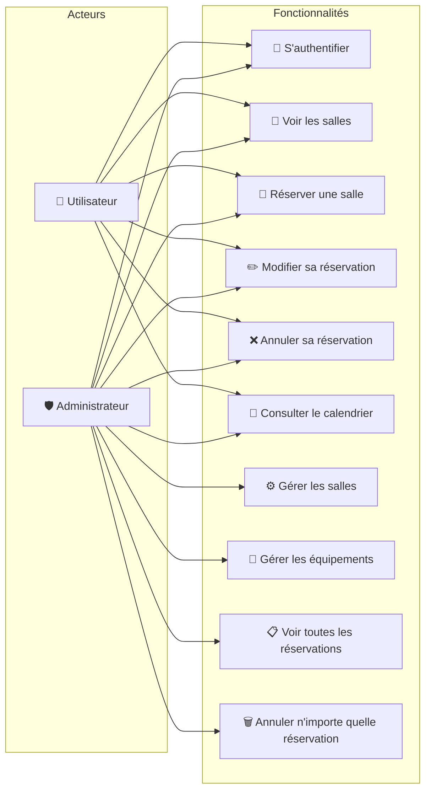
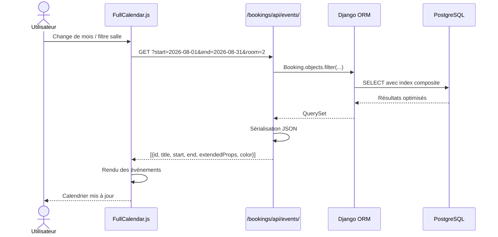

# RoomBooking — Schémas Mermaid

## 1. Diagramme Entité-Relation (Base de données)



---

## 2. Diagramme d'Architecture



---

## 3. Diagramme de Séquence — Création d'une Réservation



---

## 4. Diagramme de Cas d'Utilisation



---

## 5. Diagramme de Flux de Données — API Calendrier



---

## 6. Modèle Physique — Schéma SQL (PostgreSQL)

```sql
-- Table accounts_user (hérite de auth_user)
CREATE TABLE accounts_user (
    id BIGSERIAL PRIMARY KEY,
    password VARCHAR(128) NOT NULL,
    last_login TIMESTAMP WITH TIME ZONE,
    is_superuser BOOLEAN NOT NULL DEFAULT FALSE,
    username VARCHAR(150) NOT NULL UNIQUE,
    first_name VARCHAR(150) NOT NULL,
    last_name VARCHAR(150) NOT NULL,
    email VARCHAR(254) NOT NULL,
    is_staff BOOLEAN NOT NULL DEFAULT FALSE,
    is_active BOOLEAN NOT NULL DEFAULT TRUE,
    date_joined TIMESTAMP WITH TIME ZONE NOT NULL DEFAULT NOW(),
    role VARCHAR(10) NOT NULL DEFAULT 'user',
    phone VARCHAR(20),
    department VARCHAR(100)
);

-- Table rooms_room
CREATE TABLE rooms_room (
    id BIGSERIAL PRIMARY KEY,
    name VARCHAR(100) NOT NULL UNIQUE,
    capacity INTEGER NOT NULL CHECK (capacity > 0),
    description TEXT,
    is_active BOOLEAN NOT NULL DEFAULT TRUE,
    created_at TIMESTAMP WITH TIME ZONE NOT NULL DEFAULT NOW(),
    updated_at TIMESTAMP WITH TIME ZONE NOT NULL DEFAULT NOW()
);

-- Table rooms_equipment
CREATE TABLE rooms_equipment (
    id BIGSERIAL PRIMARY KEY,
    name VARCHAR(100) NOT NULL UNIQUE,
    description TEXT,
    icon VARCHAR(50)
);

-- Table de liaison Many-to-Many
CREATE TABLE rooms_room_equipment (
    id BIGSERIAL PRIMARY KEY,
    room_id BIGINT NOT NULL REFERENCES rooms_room(id) ON DELETE CASCADE,
    equipment_id BIGINT NOT NULL REFERENCES rooms_equipment(id) ON DELETE CASCADE,
    UNIQUE(room_id, equipment_id)
);

-- Table rooms_roomavailability
CREATE TABLE rooms_roomavailability (
    id BIGSERIAL PRIMARY KEY,
    room_id BIGINT NOT NULL REFERENCES rooms_room(id) ON DELETE CASCADE,
    day_of_week SMALLINT NOT NULL CHECK (day_of_week BETWEEN 0 AND 6),
    open_time TIME NOT NULL DEFAULT '08:00:00',
    close_time TIME NOT NULL DEFAULT '18:00:00',
    is_closed BOOLEAN NOT NULL DEFAULT FALSE,
    UNIQUE(room_id, day_of_week)
);

-- Table bookings_booking
CREATE TABLE bookings_booking (
    id BIGSERIAL PRIMARY KEY,
    user_id BIGINT NOT NULL REFERENCES accounts_user(id) ON DELETE CASCADE,
    room_id BIGINT NOT NULL REFERENCES rooms_room(id) ON DELETE CASCADE,
    title VARCHAR(200) NOT NULL,
    start_datetime TIMESTAMP WITH TIME ZONE NOT NULL,
    end_datetime TIMESTAMP WITH TIME ZONE NOT NULL,
    status VARCHAR(20) NOT NULL DEFAULT 'confirmed',
    created_at TIMESTAMP WITH TIME ZONE NOT NULL DEFAULT NOW(),
    updated_at TIMESTAMP WITH TIME ZONE NOT NULL DEFAULT NOW(),
    cancelled_at TIMESTAMP WITH TIME ZONE,
    cancelled_by_id BIGINT REFERENCES accounts_user(id) ON DELETE SET NULL,
    CONSTRAINT check_end_after_start CHECK (end_datetime > start_datetime)
);

-- Index composite pour les performances
CREATE INDEX idx_booking_overlap ON bookings_booking 
    (room_id, start_datetime, end_datetime, status);
```
